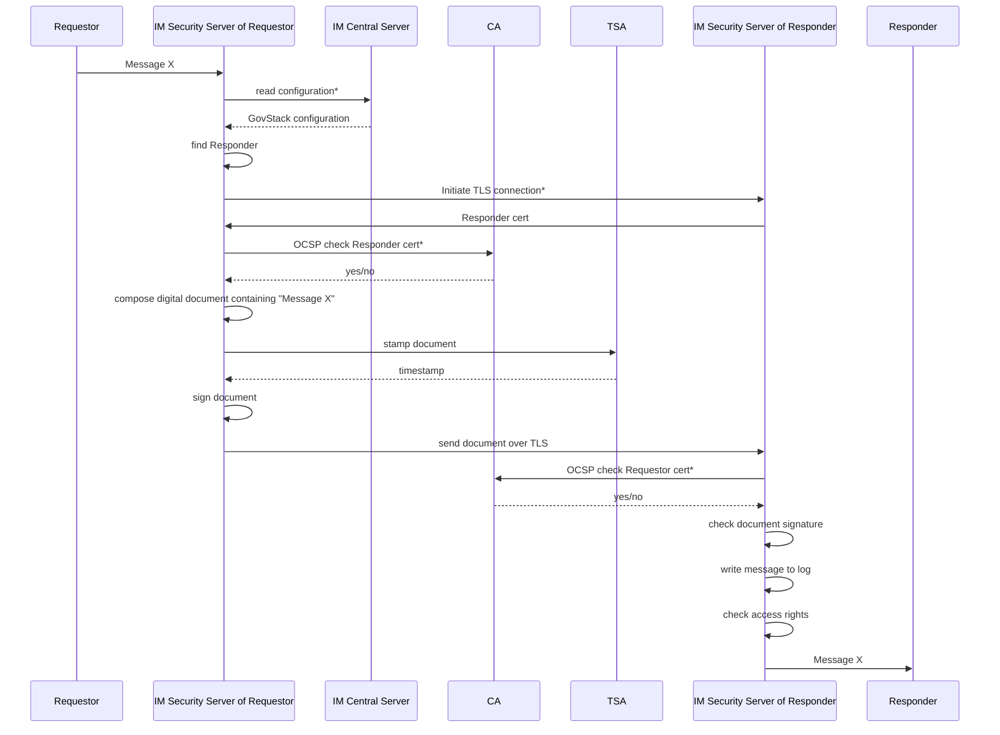
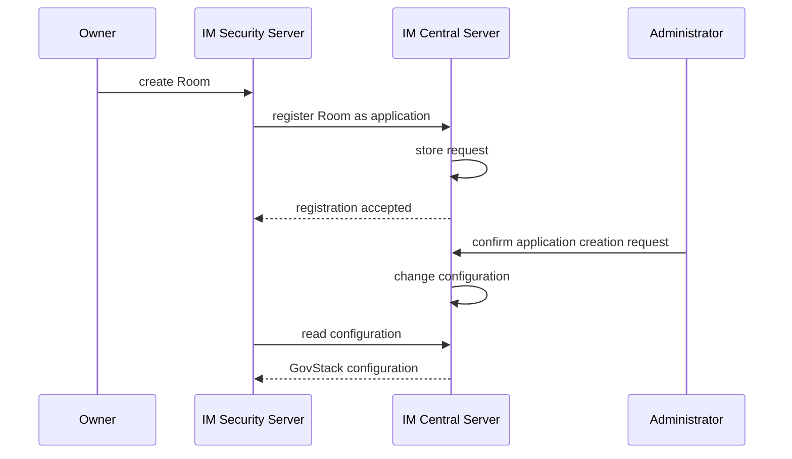
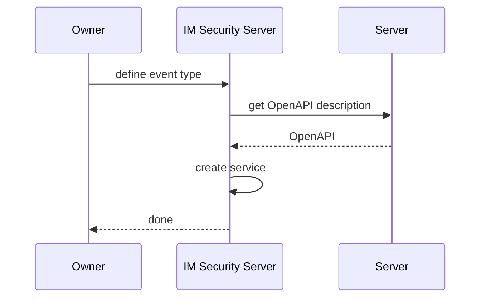
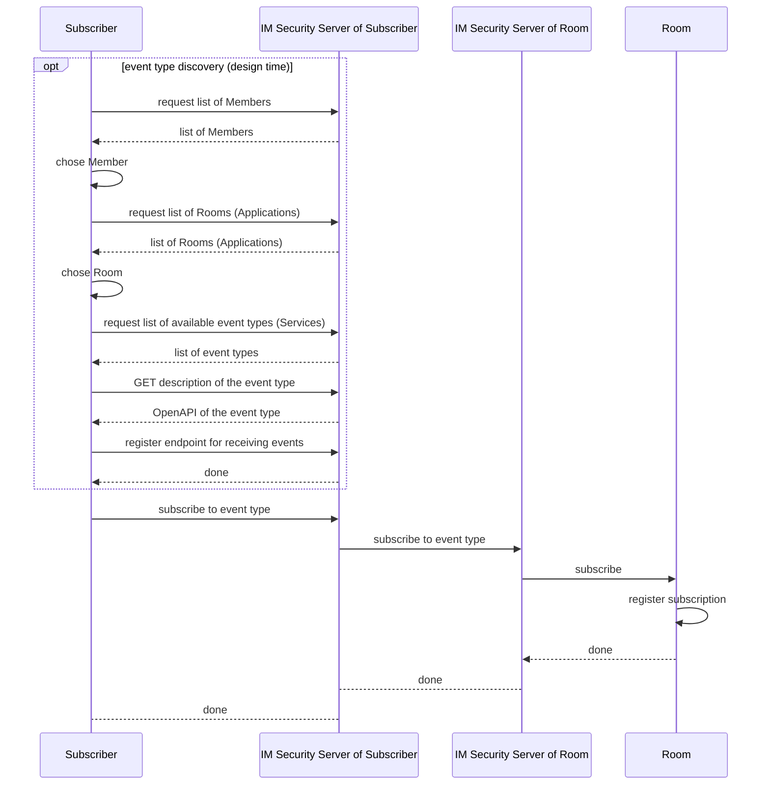
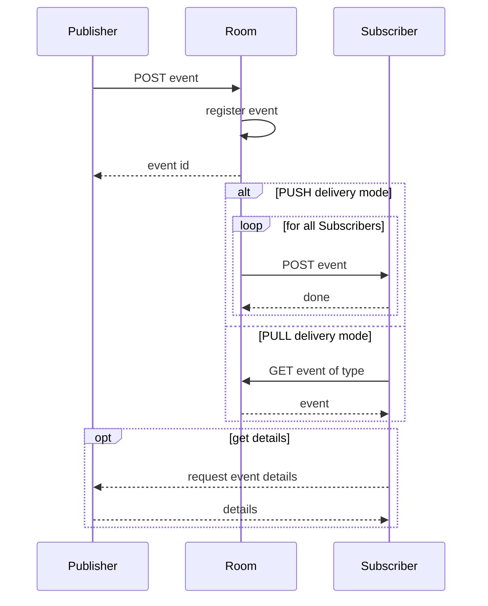

# 9 Internal Workflows

A workflow provides a detailed view of how the Information Mediator Building Block will interact with other building blocks to support common use cases. This section lists workflows that this building block must support. Other workflows may be implemented in addition to those listed.

### 9.1 Service Access Layer

Example Sequence diagram for accessing service

The results of steps marked with '\*' can be cached and reused between calls. In this diagram:

1. Requestor makes a request to the local Information Mediator security server.
2. Local Infirmation Mediator security server finds in the configuration where to send request.
3. The Information Mediator signs & sends the request from application A to the security server for application B.
4. The security server for application B receives the request, validates the signature, and then forwards it to the application/service/endpoint.
5. The application/service/endpoint responds to request.
6. The security server for application B signs the response and sends it back to the security server for application A.
7. The security server for the application A validates the signature and forwards the response to application A.
8. This is all synchronous. Application A’s request is open/unresponded until step 6.

## 9.2 PubSub Layer 

#### 9.2.1 Registering a Room

Room for PubSub MUST be created before events can be described and processed. Room is created by its owner organization (Member), the organization responsible for the operation of events of a certain type.

Creation request SHOULD be confirmed by GovStack administrator.

#### 9.2.2 Defining event type

Event type corresponds to a service description of a service accepting events for publishing and MUST be registered before usage. A single room might host multiple event types.

E.g. in India, "The Ministry Of Home Affairs" can be the "Owner" of a Room where events of type "emergency" are published by "citizens" or "entities" and entities such as "ambulance services", "Fire-fighting services", Hospitals, etc., can be Subscribers to this Room. In this scenario, an event of type "Fire emergency" can be published by any citizen enrolled in this Room. The Ministry can choose to have one "emergency" Room in each town and enroll Subscribers relevant to respective regions.

#### 9.2.3 Subscribing to events of a certain type

1. The Subscriber requests that events of certain types be delivered to them.
2. The Subscriber specifies the desired delivery mode (push/pull). The Room and Subscriber conclude the delivery contract. Note that:
   * push delivery mode is when the Room sends events to the Subscriber’s API. In this case, Subscriber MAY request some QoS/SLA parameters of delivery.
   * pull delivery mode (OPTIONAL) means that the Room keeps a queue of events and the Subscriber can check that queue.
3. At a minimum, this Building Block MUST provide for a push delivery mode. It MAY also provide a pull mode based on convenience.

Three endpoints to be declared per event type Pub/Sub instance:

* an endpoint URL to be registered by every Subscriber on a per-event type basis.
* (OPTIONAL) an endpoint URL on the Pub/Sub where all pull requests come from various Subscribers.
* an endpoint in the Room to send messages for publication.

#### 9.2.4 Event delivery

1. The Publisher and the Room have a data access contract to establish trust for accessing information.
   * This is akin to the standard trust contract in the Information Mediator, the consumer must have rights to access a certain API.
   * Publishers have to sign a contract with the Room owner’s consent to gain access to specific Rooms and events. In the contract, Publishers declare what type of message will be published in a given Room.
2. The Publisher generates an event:
   * The Publisher makes a POST call to the Room service of a particular event type.
   * The Room stores the event and replies with the event id. Event id is generated by Room or is taken from the original event dataset if provided by the publisher.
   * The Room can implement a first in, first out (FIFO) event distribution policy. If the Room provides FIFO guarantees, the Room may:
     * (a) assign a key to the event. If a key attribute is defined in the schema of the event, the value of that attribute will be used. Otherwise, the Room can assign a key at its own discretion.
     * (b) assign a sequence number to the event. The sequence number must be monotonically increasing for events that share the same key.
   * The Room sends an immediate acknowledgment to the Publisher.
3. The Room distributes an event asynchronously as follows:
   * A reference to publisher and event id is added to the event dataset.
   * For each Subscriber:
     * (alt) If the mode is ‘push’, make a POST call to Subscriber GovStack service of the event type;
     * (alt) If the mode is ‘pull’, enqueue an event for request from the Subscriber;
       * There is a queue of events waiting to be processed per the Subscriber, such that the Subscriber might periodically check to see events waiting in their own queue, process those events, and clear the queue.
       * A pull mechanism is essential for resilience to network dropouts and traffic load balance at servers and for differentiating urgent/emergency events from normal events (this can be decided during implementation).
4. (OPTIONAL - if mode is PULL) The Subscriber pulls an event:
   * The Subscriber makes a GET call to the Room service of the particular event type.
5. (OPTIONAL) The Subscriber requests event details. Some event details may have more restricted regulations for handling and may be not included in event type. In this case, the Subscriber requests these details directly from the publisher by making a GET call to the referenced Publisher with event id as a parameter.
   * This call implies the existence of an associated contract between the Subscriber and the Publisher.

The Information Mediator Building Block creates a log of all messages published and distributed.

If an event payload is very large, then it is recommended to just publish the "event" and let Subscribers get full details directly from the Publishers as needed. It will simplify event payloads, and reduce Turnaround time (TAT), storage, and bandwidth significantly.

For example, “Clinic System A” wishes to broadcast data about a new birth so that it can be used to trigger asynchronous actions in several other systems. A Service is configured in Clinic System A that makes an HTTP POST request corresponding to the type of event and some valid JSON in the body to the Pub/Sub provider. The provider maintains a list of active “Subscribers” for that event type. Without manipulating the body, that message is effectively forwarded to each subscriber, so that REST services in the “Demographics Tracker”, “Insurance Registry”, and “Early Childhood Education” applications can consume that data and do things based on it.

It should be noted that the shape of the payload will be agreed upon beforehand so that the responsibility of being able to “ingest” a “newBirth” payload from Pub/Sub will fall on the REST service provider. Once an event is ingested, the responsibility to deliver the payload lies with the Information Mediator “room” based on the importance given to the event by a Subscriber. Thus, during registration of the Subscriber, parameters such as max queue depth, retries, failsafe mechanisms, and error handling have to be configured by each Subscriber as they subscribe to an event type.
